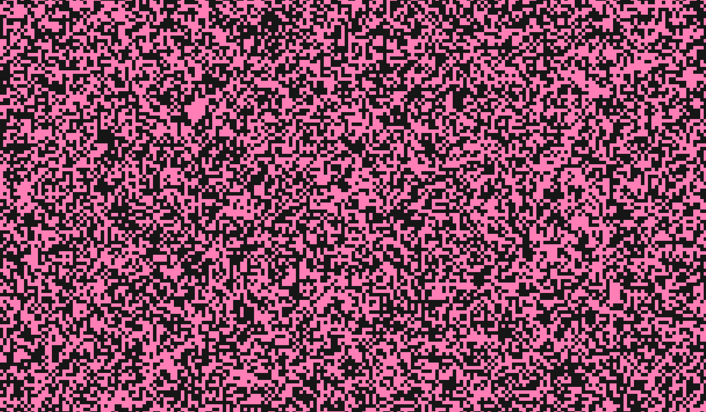
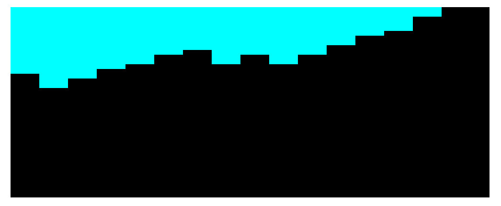

# Cube Tube

## Welcome to my first 3D game!

### Main focus of this project: Procedural Generation with Perlin Noise and 3D game development

I have had a ton of fun working on this project, and trying out Unity development for the first time!

As of end-of-day on Monday, October 28, 2024, this project is sadly not yet complete. I had hoped to be able to deliver an MVP before the deadline, but was unable due to my busy work schedule this week and other commitments.

However, I am proud of what I have been able to accomplish so far, considering that I have no prior experience with Unity or C# development, or procedural generation either. 

My initial idea was to generate the playing area using blocks as 3D tiles. However, that ended up making the game slow down quite a bit from having to render so many game objects. I instead moved to this method of creating walls, floors, and ceiling with long, rectangular blocks to save on the number of game objects required and to also shorten development time a bit for this iteration by being able to essentially produce 2D procedurally generated maps and then give them the third dimension by making the blocks long on the third axis.

### Here are a couple of screenshots of what the procedurally generated map looks like so far:

### Walls generated procedurally using Perlin Noise

### Inside the generated tunnel

### There is currently a bug that sometimes occurs where the walls turn out straight (but the floor and ceiling still generate normally)

#### My inspiration for this game was actually this webpage. You can't tell from the screenshot, but there is a circle that bounces around on the screen while scrambling the pixels within it, gradually changing the pixels of the whole screen to new randomized values as it goes. 

To get started on learning about procedural generation, I started my coding a simple webpage that procedurally generates a randomized simple 2D tile map on a canvas:

